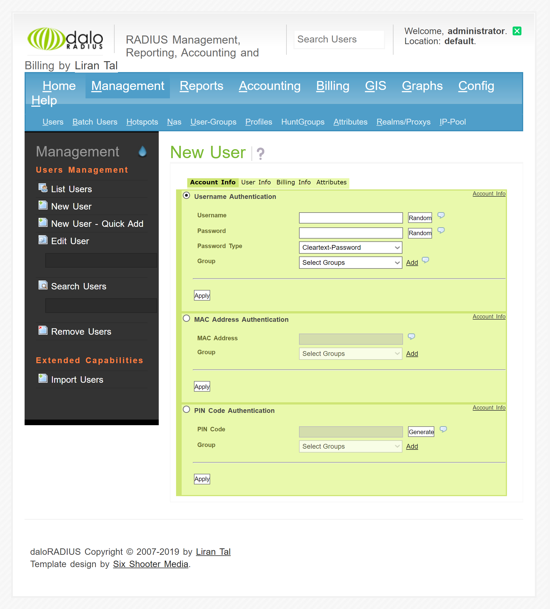

# Intro
Als Teil des Praktikums hat unser Team sich um die Accesscontrol gekümmert. Unser Team bestand aus [Sophia Menger](https://github.com/Neyrision) und [Simon Gander](https://github.com/Ayax0). 
# Inhaltsverzeichnis
1. [Inhaltsverzeichnis](#inhaltsverzeichnis)
2. [Übersicht](#%C3%BCbersicht)
3. [Dokumentation](#dokumentation)
4. [Installation MariaDB](#installation-mariadb)
5. [Installation FreeRADIUS daloRADIUS](#installation-freeradius-daloradius)
6. [Konfiguration](#konfiguration)
7. [Schwierigkeiten](#schwierigkeiten)
8. [Fazit](#fazit)

# Übersicht
Die Accesscontrol dient dazu, um Benutzer*innen einzurichten und festzulegen wer welche Rechte hat und auch unterschiedliche Logins für alle zu erstellen. Die haben wir mit FreeRADIUS erledigt, wofür wir noch eine grafische Schnittstelle namens Daloradius verwendet haben. Die Datenbank dahinter wurde mit MariaDB erstellt. DaloRADIUS stellt auch sicher, dass das anlegen und einloggen von Nutzer*innen über eine Datenbank festgehalten wird und bietet viele nützliche Tools für das einrichten der Accesscontrol.

# Dokumentation

# Installation MariaDB
1. Update des Server zu Beginn um sicherzustellen, dass der Server auf einem aktuellen Stand ist, soll der Befehl 

`sudo apt update && sudo apt -y upgrade` 

ausgeführt werden.

2. MariaDB installieren
MariaDB kann mit dem Befehl 

`sudo apt -y install mariadb-server mariadb-client`

installiert werden. Der Server ist schlussendlich die DB selbst und der Client ist was es uns erlaubt auf die DB zuzugreifen.

3. MariaDB server sicherstellen
Zuletzt soll sollen mehrere Sicherheitseinstellungen vorgenommen werden.
Diese Einstellungen sind:
    - Neues sicheres Passwort setzen
    - Anonymer Account entfernen
    - Remote Login für root Account deaktivieren
    - Test Datenbank entfernen

Dies kann mit dem Befehl
 
`sudo mysql_secure_installation`

 gemacht werden. Bei den nachfolgenden prompts muss überall Ja ausgewählt werden und das Passwort kann direkt nach dem ersten prompt gesetzt werden.

Zuletzt muss noch sichergestellt dass der Root Account als Normaler Account gilt, dies machen wir in dem die Rechte entfernt werden mit folgendem Kommando welches die DB Verbindung öffnet:

`sudo mysql -u root`

Danach öffnet sich die Verbindung zur DB und man ist als root Account eingeloggt. Jetzt kann man den SQL Befehl ausführen um die Rechte zu aktualisieren:

```
UPDATE mysql.user SET plugin = ‘mysql_native_password’ WHERE User = ‘root’;

FLUSH PRIVILEGES;

QUIT;
```

# Installation FreeRADIUS daloRADIUS

1. Maria DB Konfigurieren
Damit FreeRadius installiert werden kann muss zuerst MariaDB installiert werden, ist dies noch nicht gemacht sollte der vorherige Teil der Dokumentation zuerst ausgeführt werden.
Sobald die DB installiert ist, muss eine Datenbank für radius erstellt werden, die wird mit folgenden Kommandos eingerichtet: 

```
mysql -u root -p

CREATE DATABASE radius;

GRANT ALL ON radius.* TO radius@localhost IDENTIFIED BY “StrongradIusPass”;

Flush Privileges;

\q
```

Das “StrongradIusPass” Parameter ist das Passwort was man setzt, hier kann jedes beliebige Passwort gesetzt werden.

2. Apache Webserver und PHP installieren
Als nächstes wird der Apache server und PHP installiert da daloRADIUS diese benötigt:

```
sudo apt -y install apache2
sudo apt -y install php libapache2-mod-php php-{gd,common,mail,mail-mime,mysql,pear,mbstring,xml,curl}
```

anschliessend müssen der http und https port nutzbar sein selbst wenn ufw läuft, dies wird mit folgenden Kommandos erledigt:

```
sudo ufw allow http
sudo ufw allow https
```

3. FreeRADIUS installieren
FreeRADIUS kann mit hilfe dieser Befehle installiert und anschließend gestartet werden:

```
sudo apt -y install freeradius freeradius-mysql freeradius-utils
sudo systemctl enable --now freeradius.service 
```

4. FreeRADIUS Configurieren
Für das Konfigurieren braucht es mehrere Subschritte, welche nun gelisted werden.


- radius schemas importieren
Zuerst muss das Schema der Datenbank importiert werden, damit diese nicht von Grund auf konfiguriert wird. Der Befehl für das importieren des Schema lautet:

```
sudo su -
mysql -u root -p radius < /etc/freeradius/*/mods-config/sql/main/mysql/schema.sql
```

- Radius sql Module konfigurieren
bei dem jetzigen Schritt muss zuerst ein link für das SQL Modul erstellt werden, sobald dies erledigt ist muss man über einen Texteditor die Einstellungen der DB anpassen. Dies passiert über folgende Befehle.

```
sudo ln -s /etc/freeradius/*/mods-available/sql /etc/freeradius/*/mods-enabled/
sudo vim /etc/freeradius/*/mods-enabled/sql
```

Die angepasste Einstellung soll bei der SQL Eigenschaft so aussehen:

```
sql {
    driver = "rlm_sql_mysql"
    dialect = "mysql"

    # Connection info:

    server = "localhost"
    port = 3306
    login = "radius"
    password = "StrongradIusPass"

    # Database table configuration for everything except Oracle

    radius_db = "radius"
}
```

- Gruppenrechte anpassen
Zuletzt müssen noch die Gruppenrechte angepasst werden für das File `/etc/freeradius/*/mods-enabled/sql`.

```
sudo chgrp -h freerad /etc/freeradius/*/mods-available/sql
sudo chown -R freerad:freerad /etc/freeradius/*/mods-enabled/sql
```

5. daloRADIUS installieren und konfigurieren
Nach dem Installieren und Konfigurieren von FreeRADIUS kann nun daloRADIUS installiert und konfiguriert werden. Das Installieren erfolgt über folgende Befehle:

```
sudo apt -y install wget unzip
wget https://github.com/lirantal/daloradius/archive/master.zip
unzip master.zip
mv daloradius-master/ daloradius
```

Anschließend muss der Ordner ausgewählt werden und Tabellen für dalorRADIUS erstellt werden.

```
cd daloradius
mysql -u root -p radius < contrib/db/fr2-mysql-daloradius-and-freeradius.sql 
mysql -u root -p radius < contrib/db/mysql-daloradius.sql
```

Als nächstes muss der dalorRADIUS Ordner verschoben werden nach `/var/www/html` und anschließend Berechtigungen gesetzt werden.

```
cd ..
sudo mv daloradius /var/www/html/
sudo mv /var/www/html/daloradius/library/daloradius.conf.php.sample /var/www/html/daloradius/library/daloradius.conf.php
sudo chown -R www-data:www-data /var/www/html/daloradius/
sudo chmod 664 /var/www/html/daloradius/library/daloradius.conf.php
```

Zuletzt muss nun die `daloradius.conf.php` Datei angepasst werden.

`sudo vim /var/www/html/daloradius/library/daloradius.conf.php`

Der Datenbankname, Account und das Passwort für die Datenbank müssen angepasst werden wie folgend:

```
$configValues['CONFIG_DB_HOST'] = 'localhost';
$configValues['CONFIG_DB_PORT'] = '3306';
$configValues['CONFIG_DB_USER'] = 'radius';
$configValues['CONFIG_DB_PASS'] = 'StrongradIusPass';
$configValues['CONFIG_DB_NAME'] = 'radius';
```

Zuletzt muss FreeRADIUSs nun neu gestartet werden mit folgendem Befehl:

`sudo systemctl restart freeradius.service apache2`

6. daloRADIUS access
Für das daloRADIUS Webinterface müssen noch zwei Module installiert werden, nämlich DB und MDB2 welches über folgenden Befehl passiert:

```
sudo pear install DB
sudo pear install MDB2
```

Nun Kann daloRADIUS über die URL `http://server_ip_or_hostname/daloradius` genutzt werden. “server_ip_or_hostname” muss dann einfach mit der jeweiligen IP oder dem Hostname des Radius Servers ersetzt werden.

Der Standard Login für daloRADIUS lautet wie folgt:
```
Username: administrator
Passwort: radius
```

Nun kann FreeRADIUS über die daloRADIUS Benutzerschnittstelle genutzt werden.

# Konfiguration
Um einen neuen Account zum Radius System hinzuzufügen, welcher für die Authentifizierung im Wlan verwendet wird, müssen unter `Management --> Users --> New User` die gewünschten Anmeldedaten eingetragen werden. Nach dem bestätigen über den Knopf `Apply` kann sich mithilfe dieser Anmeldedaten angemeldet werden.


# Schwierigkeiten
Als wir den Accesspoint im Praktikum umgesetzt haben, hatten wir ein großes Problem, bei dem loggen, jedes Mal beim Erstellen gab es einen Fehler, dies kam daher dass wir die Befehle:
```
mysql -u root -p radius < contrib/db/fr2-mysql-daloradius-and-freeradius.sql 
mysql -u root -p radius < contrib/db/mysql-daloradius.sql
```
Direkt gleichzeitig haben durchführen lassen. Üblicherweise funktioniert dies auch, jedoch muss nach dem Befehl ein Passwort eingegeben werden. Dies sorgt dafür, dass der zweite  Befehl abgebrochen wird und somit dann die andere Hälfte der DB fehlt. Als wir zuhause nochmal das Ganze abgespielt haben ist uns aufgefallen warum es also beim Praktikum nicht funktioniert hat.

Um einen Accesspoint zum Radius Server zu verbinden wird ein Passwort benötigt. Wir haben erst nach etwas suchen herausgefunden dass dieses Passwort in der Datei `/etc/freeradius/3.0/clients.conf` gesetzt werden kann. hier können für die verschiedenen Accesspoint einträge hinzugefügt werden, in welchen auch ein `secret` definiert wird. So ein eintrag kann beispielsweise so aussehen:
```
client ap01 {
    ipaddr = 10.16.1.10
    secret = testing123
}
```

# Fazit
Das grundsätzliche Umsetzen selbst hat uns wenig Schwierigkeiten bereitet. Das größte Problem war es die Linux Maschine zum laufen zu bringen. Zusätzlich haben wir noch ein Webinterface erstellt und eine Datenbank, die Grundidee wäre ja ein Config File und das Steuern rein über die Kommandozeile also denken wir, dass wir über das Ziel hinausgeschossen sind. Was uns noch etwas Mühe machten waren die diversen Konfigurationen die vorgenommen werden mussten für die Datenbank, PHP und dass bei dem Grundschema diverse Tabellen gefehlt haben die wir manuell nachtragen mussten, jedoch war das alles einfach zu nachvollziehen da wir Fehler Meldungen zurückbekommt oder wir wussten dass es irgendwas mit der IP Konfiguration zu tun haben musste. Demnach war für unser Team das Projekt ein Erfolg.
